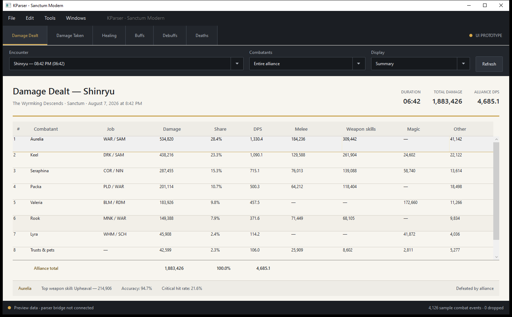

# KParser - Sanctum Edition

KParser - Sanctum Edition is a Windows combat parser for Final Fantasy XI private-server environments. It combines a modern WPF dashboard with a modified KParser engine that reads local client chat data, maintains parse history, and exposes reports to the interface through a restricted local bridge.

This project is a modified derivative of KParser, originally created by David Smith. It is not an unrelated reimplementation and is distributed under the GNU General Public License, version 2 or, at your option, any later version.

## Project status

The current development release is **Preview 22**, assembly version **0.22.0**. It is usable on Sanctum but should still be treated as preview software. Memory layouts, private-server client builds, and combat-log behavior can change.

## Highlights

- Automatic Sanctum/XiLoader process and chat-log detection
- Running-total, current-fight, individual-fight, and per-monster reports
- Damage dealt and taken, healing, buffs, debuffs, deaths, fights, experience, HELM, crafting, chat, and item-drop reports
- Melee, ranged, weapon-skill, ability, magic, skillchain, additional-effect, reactive-damage, calculated DoT, accuracy, and multi-attack views
- Offensive and defensive buff-performance analysis
- Expanded curing, status-removal, and Corsair roll statistics
- Compact live monitor with one-second refresh, transparency, and party/alliance/player filtering
- CSV export and party-chat summary support
- Named player parse snapshots and side-by-side build comparisons
- Local player-information labels and notes
- Dark and light interface themes

## How it works

The application has two cooperating Windows processes:

1. The modified 32-bit KParser engine handles memory detection, chat parsing, and the legacy SQL Server Compact database.
2. The 64-bit .NET 10 WPF interface requests immutable report snapshots through a versioned named pipe restricted to the current Windows user.

The interface cannot send arbitrary commands to the engine. The bridge accepts only start, stop, reset, detect, shutdown, and read-only report requests. See [Architecture](docs/ARCHITECTURE.md).

## Installation

Use either the setup executable or the portable executable from a matching tagged release. Do not download KParser binaries from an untrusted source because the application reads another process and can send keyboard input when the user requests a party summary.

Detailed instructions are in [Installation and use](docs/INSTALLATION.md).

## Building from source

The modern interface and legacy engine use different toolchains. The interface targets .NET 10 for Windows; the legacy engine targets 32-bit .NET Framework 3.5 and SQL Server Compact 4.0.

See [Building from source](docs/BUILDING.md) for prerequisites and verified project paths.

Repository owners should also read [Publishing this folder on GitHub](docs/GITHUB-SETUP.md) before the first push.

## Repository layout

    src/modern-ui/       Modern .NET 10 WPF interface
    src/legacy-engine/   Modified GPL KParser engine and plugins
    tests/               Bridge, portable-package, comparison, and memory probes
    installer/           Inno Setup definition; generated payload is excluded
    docs/                Architecture, privacy, history, release, and license notes
    assets/              Repository images

Generated executables, parse databases, user settings, and installer payloads are intentionally excluded from source control.

## Data and privacy

KParser reads chat and selected player-state information from a locally running FFXI process. Parse databases, settings, exports, and saved build comparisons are stored locally. The project does not include dedicated analytics or telemetry, but inherited legacy components include an obsolete Google translation helper and an optional localhost ZeroMQ packet-reader path. See [Privacy and memory access](docs/PRIVACY-AND-MEMORY-ACCESS.md).

## Compatibility

Sanctum Edition is designed and tested for Sanctum's supported XiLoader/FFXI client environment. It is not guaranteed to work with retail FFXI, EdenXI, HorizonXI, or other private servers without memory-layout and parser changes.

Run KParser at the same Windows privilege level as XiLoader/FFXI. If one process is elevated and the other is not, memory detection and chat access may fail.

## History and attribution

Sanctum Edition is based on the HorizonXI-hotfix lineage from [poroburu/kparser](https://github.com/poroburu/kparser), itself a fork of [Kinematics/kparser](https://github.com/Kinematics/kparser) and an export of the original Google Code KParser project. The recorded starting tag is HorizonXI-Hotfix at commit a3dc8d095b3d3bc888fcea0b4e0a881ed5a08751.

Original KParser copyright (C) 2007-2009 David Smith. Sanctum Edition modifications copyright (C) 2026 Sanctum Edition contributors.

See [Project history](docs/PROJECT-HISTORY.md), [Modification notice](MODIFICATIONS.md), and [Notices](NOTICE.md).

## License

KParser - Sanctum Edition is licensed under the GNU General Public License, version 2 or, at your option, any later version. See [LICENSE](LICENSE).

Every binary release must be accompanied by, or provide equivalent access to, the complete corresponding source for that exact release. See [Open-source compliance](docs/OPEN-SOURCE-COMPLIANCE.md) and [Release process](docs/RELEASING.md).

## Disclaimer

This community project is not affiliated with, endorsed by, or sponsored by Square Enix, the original KParser author, Kinematics, EdenXI, HorizonXI, or the maintainers of any other private server. FINAL FANTASY and related names are trademarks or registered trademarks of their respective owners. No game client, server software, copyrighted game data, or Square Enix assets are distributed by this repository.
